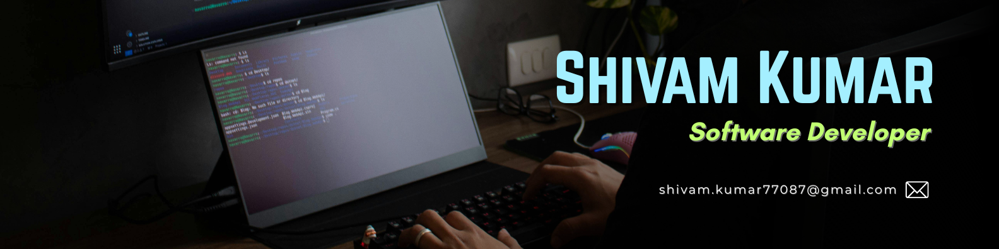

<h1 align="left">Hello, I'm @Shivam 👋</h1>

  

<h2 align="left">About me</h2>

  Passionate software engineer specializing in <b>.NET</b> and <b>Spring Boot</b> backends,
  <b>Angular</b> and <b>React</b> frontends, and <b>Ionic</b> for cross-platform mobile apps,
  with a strong emphasis on modern <b>DevOps</b> practices.

<ul>
  <li>💼 Currently working as a software engineer at <b>Streamsequence Techonology</b></li>
  <li>🌱 I'm constantly learning and exploring new technologies in MERN stack and DevOps</li>
  <li>🧑‍💻 I enjoy building mobile apps with <b>Expo Ionic</b></li>
</ul>

<h2 align="left">Languages and Tools</h2>

  
  
  
  
  
  
  
  
  
  

